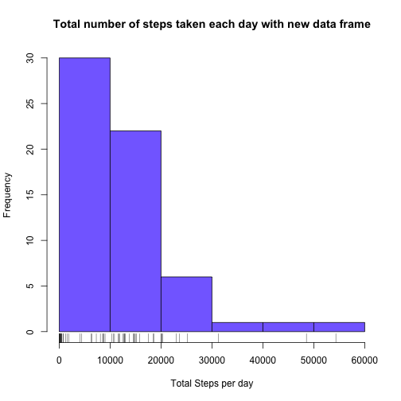

## Loading and preprocessing the data

Show any code that is needed to

1. Load the data (i.e. read.csv())
2. Process/transform the data (if necessary) into a format suitable for your analysis


```r
setwd("~/Coursera/Reproducible/RepData_Project1/")
unzip("activity.zip")
activity <- read.csv("activity.csv")
```

## What is mean total number of steps taken per day?

For this part of the assignment, you can ignore the missing values in the dataset.

1. Make a histogram of the total number of steps taken each day

```r
# Total number of steps per day. Used the na.rm option to ignore the missing values
total.steps <- tapply(activity$step,activity$date,function(x) sum(x,na.rm=TRUE))
hist(total.steps,xlab="Total Steps per day", main="Total number of steps taken each day",col="salmon")
rug(total.steps) #Added rug to see where the points are within the bins
```


2. Calculate and report the mean and median total number of steps taken per day

```r
total.mean <- summary(total.steps)[["Mean"]]
total.mean
```

```
## [1] 9354
```

```r
total.median <- summary(total.steps)[["Median"]]
total.median
```

```
## [1] 10400
```

## What is the average daily activity pattern?

1. Make a time series plot (i.e. type = "l") of the 5-minute interval (x-axis) and the average number of steps taken, averaged across all days (y-axis)


```r
# Removed all NA values in computing the average
mean_steps <- tapply(activity$steps,activity$interval,function(x) mean(x,na.rm=TRUE))
# First apply as.table to convert the array with names to a table. Then convert table to data frame. 
mean.steps <- as.data.frame(as.table(mean_steps))
# Assigned column names
names(mean.steps) <- c("interval","avgsteps")
# Convert the interval column from factor to integer in order to plot a time series
mean.steps$interval <- as.integer(as.character(mean.steps$interval))
plot(mean.steps$interval,mean.steps$avgsteps,type="l",xlab="Interval (5-min periods)", ylab="Average # of steps", main="Time series plot of Average number of steps across all days",lwd=2,col="blue")
```


2. Which 5-minute interval, on average across all the days in the dataset, contains the maximum number of steps?


```r
max.mean.inv <- as.integer(names(mean_steps[mean_steps==max(mean_steps)]))
max.mean.inv
```

```
## [1] 835
```

## Imputing missing values

Note that there are a number of days/intervals where there are missing values (coded as NA). The presence of missing days may introduce bias into some calculations or summaries of the data.

1. Calculate and report the total number of missing values in the dataset (i.e. the total number of rows with NAs)

```r
total.na <- sum(is.na(activity$steps))
total.na
```

```
## [1] 2304
```
2. Devise a strategy for filling in all of the missing values in the dataset. The strategy does not need to be sophisticated. For example, you could use the mean/median for that day, or the mean for that 5-minute interval, etc.

- The strategy I used is to use impute missing values is to use the mean for that 5-minute interval. This is because there are certain days in which there are all NAs for every interval therefore cannot use the mean for that day method for some of the days. 

3. Create a new dataset that is equal to the original dataset but with the missing data filled in.


```r
# Did a left join between the original dataset and the dataset that has the mean for the 5-minute intervals
newdf <- merge(activity, mean.steps,by="interval",all.x=TRUE,all.y=FALSE) #left join by setting left only to be TRUE

# Using this ifelse function, filled in NA with the mean of the interval
newdf$newsteps <- ifelse(is.na(newdf$steps),round(newdf$avgsteps,0),newdf$steps)

# Change the df name to something more descriptive
activity.new <- newdf

# Dropped variables
activity.new$steps <- activity.new$avgsteps <- NULL
```

4. Make a histogram of the total number of steps taken each day and Calculate and report the mean and median total number of steps taken per day. Do these values differ from the estimates from the first part of the assignment? What is the impact of imputing missing data on the estimates of the total daily number of steps?


```r
# Total number of steps per day for new data frame. 
total.steps.new <- tapply(activity.new$newsteps,activity$date, sum)
hist(total.steps.new,xlab="Total Steps per day", main="Total number of steps taken each day with new data frame",col="lightslateblue")
rug(total.steps.new) #Added rug to see where the points are within the bins
```



```r
# Both histograms. Used rgb function so that I can adjust the alpha (transparency) level
hist(total.steps,xlab="Total Steps per day", main="Both Histograms",col=rgb(1,0,0,0.5),xlim=c(0,60000),ylim=c(0,30))
hist(total.steps.new,col=rgb(0,0,1,0.5),add=TRUE)
legend("topright",c("Original (ignore NA)","New (imputed NA)"),fill=c("salmon","lightslateblue")) # After adjusting the colors match salmon and lightslateblue best
box() #This just puts a box around the figure
```


- Yes there is a difference. As you can see from the histogram of the new dataset, there is a significant shift to the left hence having more lower sums of total steps, but also there is also a huge increase in range. You can see that the it goes to 60,000 as opposed to the original range which has a max at around 25,000

## Are there differences in activity patterns between weekdays and weekends?

For this part the weekdays() function may be of some help here. Use the dataset with the filled-in missing values for this part.

1. Create a new factor variable in the dataset with two levels -- "weekday" and "weekend" indicating whether a given date is a weekday or weekend day.


```r
# Convert the date column to have Date format in order to use the weekdays function
activity.new$date <- as.Date(activity.new$date)

# Create new factor column
activity.new$wkdy <- ifelse(weekdays(activity.new$date) %in% c("Saturday","Sunday"),"weekend","weekday")
```

2. Make a panel plot containing a time series plot (i.e. type = "l") of the 5-minute interval (x-axis) and the average number of steps taken, averaged across all weekday days or weekend days (y-axis). The plot should look something like the following, which was created using simulated data:


```r
# Use the aggregate function to find the average grouped by interval and wkdy
agg.data <- aggregate(newsteps~wkdy+interval,data=activity.new,mean)

# Install the ggplot2 library
library(ggplot2)

ggplot(agg.data,aes(x=interval,y=newsteps))+ 
  geom_line()+ #layer
  facet_wrap(~wkdy,nrow=2)+ #facet view
  ylab("Number of steps")+ #y axis label
  ggtitle("Time series of number of steps by interval (weekday & weekend)")
```


